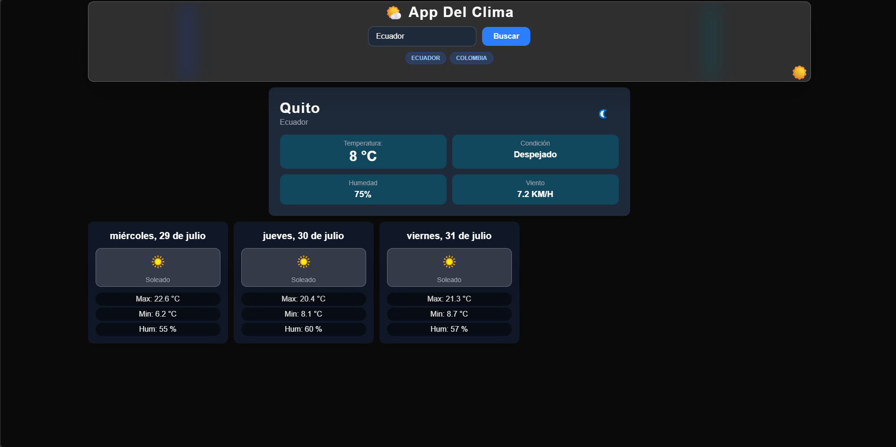

# 🌤️ Weather App

Aplicación web del clima que muestra el clima actual y el pronóstico extendido para cualquier ciudad del mundo. Desarrollada con **Next.js**, **TypeScript**, **Tailwind CSS** y la API de **WeatherAPI**.

---

## 🚀 Características

- ✅ Clima actual (temperatura, condición, humedad, viento).
- ✅ Pronóstico extendido para 5 días.
- ✅ Búsqueda por ciudad.
- ✅ Historial de búsquedas guardado en `localStorage`.
- ✅ Modo oscuro/claro con persistencia.
- ✅ Skeletons de carga para mejorar la experiencia de usuario.
- ✅ Diseño responsive (móvil, tablet, desktop).
- ✅ Manejo de errores y estados de carga.

---

## 🛠️ Tecnologías utilizadas

- **Framework:** Next.js 14 (App Router)
- **Lenguaje:** TypeScript
- **Estilos:** Tailwind CSS
- **HTTP Client:** Axios
- **API:** [WeatherAPI](https://www.weatherapi.com/)
- **Despliegue:** Vercel (recomendado)

---

## 🎨 Demo en vivo

Puedes ver la aplicación desplegada en Vercel aquí: https://weather-app-three-pied-95.vercel.app/

---

## 📸 Capturas de pantalla



---

🤝 Contribuciones

Este es un proyecto personal para mi portafolio, pero si tienes sugerencias o mejoras, ¡son bienvenidas! Abre un issue o un pull request.

---

## 👨‍💻 Autor

Mao Machado
GitHub: https://github.com/MaoMachado
LinkedIn: https://www.linkedin.com/in/maomachado/

---

## 🙏 Agradecimientos

- WeatherAPI por proporcionar la API gratuita.
- Tailwind CSS por el sistema de estilos.
- Next.js por el framework.

---

## 📬 Contacto

Si tienes preguntas o sugerencias, no dudes en contactarme:

- Email: maomachado@example.com

---

## 📦 Instalación y configuración

### 1. Clonar el repositorio
```bash
git clone https://github.com/MaoMachado/weather-app.git
cd weather-app
